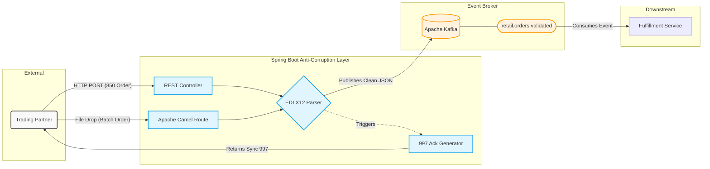

# EDI X12 Anti-Corruption Layer (Spring Boot & Kafka)


### Overview
This project is an enterprise-grade proof-of-concept demonstrating how to integrate legacy Electronic Data Interchange (EDI) protocols with modern, event-driven microservices.

It acts as an **Anti-Corruption Layer (ACL)**, ingesting archaic, position-based X12 payloads (specifically the 850 Purchase Order), parsing the segments without relying on heavy third-party XML converters, and publishing strictly typed, normalized JSON events to a message broker for downstream domain consumption.

### Architecture & Data Flow
1. **Multi-Protocol Ingestion:** - **REST API:** A Spring Boot controller simulates an API Gateway receiving raw EDI text payloads over synchronous HTTP.
    - **Asynchronous File Drop:** An Apache Camel route watches a local directory (`/edi-inbound`) for legacy batch file drops, sanitizes the payloads, and archives processed files to a `.done` folder.
2. **Translation Layer:** A custom, stream-based parser efficiently processes the EDI string by handling standard segment (`~`) and element (`*`) delimiters.
3. **B2B Acknowledgment:** The system automatically generates and returns a raw **X12 997 Functional Acknowledgment** to the trading partner to confirm syntax acceptance.
4. **Domain Normalization:** Raw X12 data is mapped into a pristine, strongly-typed Java Record (`RetailOrderDomain`).
5. **Event Publishing:** The application serializes the clean domain model to JSON and securely publishes it to an Apache Kafka topic using a designated partition key.
6. **Event Consumption:** A downstream `@KafkaListener` independently consumes the validated event, simulating a decoupled microservice.



### Tech Stack
* **Language:** Java 17
* **Framework:** Spring Boot (Web, Kafka, Test)
* **Integration:** Apache Camel
* **Message Broker:** Apache Kafka (KRaft mode)
* **Containerization:** Docker & Docker Compose (Multi-stage build)
* **CI/CD:** GitHub Actions

---

### How to Run Locally

This project is fully containerized. You do not need Kafka or Java installed locally to run the full stack, just Docker.

**1. Start the Infrastructure**
This command builds the Spring Boot application via a multi-stage Dockerfile and spins it up alongside a standalone Kafka broker on the same network.
```bash
docker-compose up --build -d
```

**2. Follow the Application Logs**
To watch the pipeline process in real-time, attach to the Spring Boot container logs:
```bash
docker logs -f edi-spring-api
```

**3. Fire the Test Payload**
Open a new terminal window and send a raw X12 850 document to the ingestion endpoint:
```bash
curl -X POST http://localhost:8080/api/v1/edi/parse/850 \
     -H "Content-Type: text/plain" \
     -d 'ISA*00* *00* *ZZ*RETAILER123    *ZZ*SUPPLIER999    *260309*1530*U*00401*000000001*0*P*>~GS*PO*RETAILER123*SUPPLIER999*20260309*1530*1*X*004010~ST*850*0001~BEG*00*SA*PO-987654**20260309~PO1*1*100*EA*12.50**UP*012345678905~PO1*2*50*EA*8.75**UP*098765432109~CTT*2~SE*7*0001~GE*1*1~IEA*1*000000001~' 
```

**4. View the Result**
In your container logs, you will instantly see the Anti-Corruption layer successfully parse the text, publish it to Kafka, and the downstream consumer independently read the clean JSON event.

### Automated Testing
The repository includes a robust suite of automated tests:
* **Web Layer:** `@WebMvcTest` verifies the HTTP ingestion and 997 Acknowledgment generation.
* **Integration Routing:** `CamelTestSupport` combined with `NotifyBuilder` tests the asynchronous file ingestion and archiving mechanisms in isolation.
* **Domain Logic:** Strict JUnit 5 tests validate the EDI parser's edge cases and X12 padding rules.
* **Mocking:** `@MockitoBean` safely mocks the Kafka infrastructure to ensure builds run smoothly in CI/CD environments without requiring a live broker.

These tests run automatically on every push to the main branch via GitHub Actions.

To run them manually locally:
```bash
mvn test 
```

### Clean Up
To stop the containers and remove the isolated Docker network:
```bash
docker-compose down
```